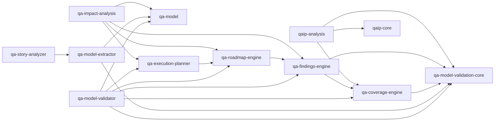
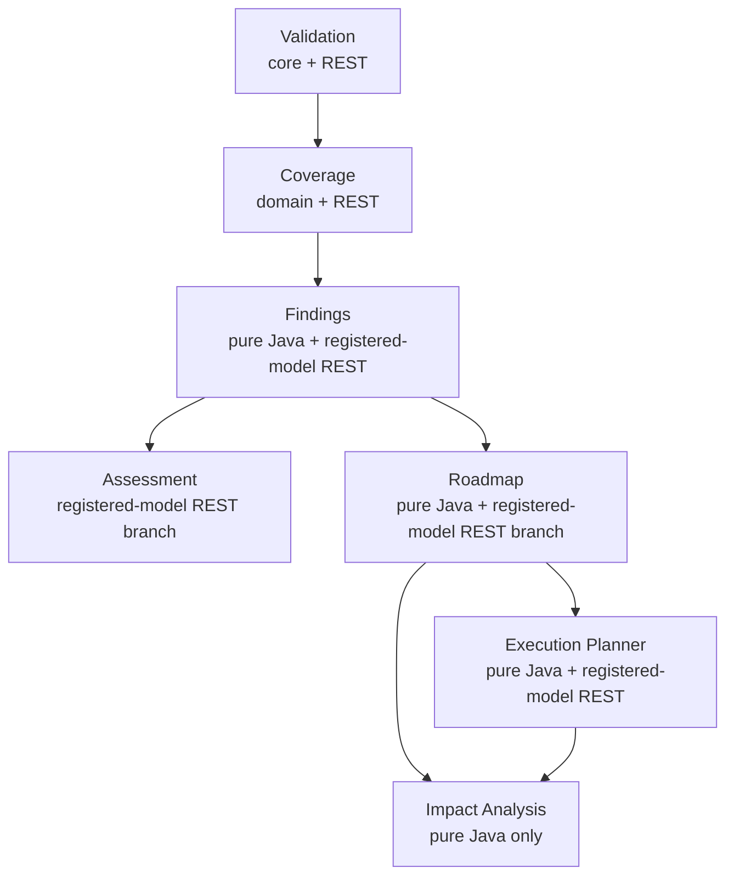

# QAIP System Architecture

## Purpose

QAIP represents quality-engineering knowledge as a normalized QA model and
provides deterministic validation, structural analysis, remediation planning,
execution-wave planning, and expected remediation-impact analysis. The
repository also contains model extraction, story analysis, and a general
analysis-engine abstraction. These are related capabilities, not one monolithic
runtime pipeline.

## System context

The normalized QA model is a JSON graph of typed nodes and relationships.
Validation establishes schema and semantic validity. Coverage and Findings
describe structural completeness and actionable gaps. Assessment summarizes
current quality state, while Roadmap separately turns findings into remediation
tasks. Execution Planner assigns existing tasks to deterministic waves. Impact
Analysis describes the structural change expected after valid task completion;
it neither executes tasks nor modifies a model.

`qa-model-validator` exposes the registered-model boundary. It validates and
stores models in a thread-safe in-memory repository, then orchestrates analysis
for individual REST requests. Models and derived reports are not persisted in
an external database.

## Actual Gradle module dependencies

Arrows mean “depends on”. Only direct project dependencies declared in the
module build files are shown.

Non-transitive Gradle declarations make several domain contracts direct
compile-time dependencies even when they are conceptually upstream through
another module. No upstream Roadmap or Execution module depends on Impact
Analysis.

## Conceptual capability pipeline

The conceptual sequence is not identical to either the module graph or a
single API call. Assessment and Roadmap are separate consumers of related
evidence.

The registered-model API currently exposes registration, retrieval, trace,
Coverage, Findings, Assessment, Roadmap, and Execution Plan endpoints. It does
not expose Impact Analysis. The Execution Plan request explicitly runs
Coverage → Findings → Roadmap → Execution Planner once within its application
service. Assessment is not called by Roadmap or Execution planning.

The actual `qa-model-validator` paths are:

| Method and path | Capability |
|---|---|
| `POST /api/v1/qa-model/validate` | Validation without registration |
| `POST /api/v1/models` | Register a valid model |
| `GET /api/v1/models` | List model descriptors |
| `GET /api/v1/models/{modelId}` | Retrieve a model |
| `GET /api/v1/models/{modelId}/info` | Retrieve its descriptor |
| `GET /api/v1/models/{modelId}/trace` | Directed trace |
| `GET /api/v1/models/{modelId}/coverage` | Coverage |
| `GET /api/v1/models/{modelId}/findings` | Findings |
| `GET /api/v1/models/{modelId}/assessment` | Assessment branch |
| `GET /api/v1/models/{modelId}/roadmap` | Roadmap branch |
| `GET /api/v1/models/{modelId}/execution-plan` | Execution Plan |

Other Spring applications expose standalone extraction, story-analysis,
coverage, and traceability endpoints. They are not registered-model endpoints
and are not invoked over HTTP by the registered-model orchestration.

## Architectural boundaries

- **Domain/core boundary:** `qa-model`, `qa-model-validation-core`, Findings,
  Roadmap, Execution Planner, Impact Analysis, and `qaip-core` provide reusable
  contracts or deterministic computation. Findings depends on a coverage
  module that also contains a Spring application, so the physical module
  boundary is not completely framework-pure end to end.
- **Framework boundary:** `qa-model-validator`, `qa-model-extractor`,
  `qa-story-analyzer`, and `qa-coverage-engine` apply Spring Boot or expose web
  controllers. `qaip-analysis` is a Java library orchestration layer.
- **Persistence boundary:** registered models live only in
  `InMemoryQaModelRepository`; reports, tasks, plans, and impacts are not
  persisted.
- **Orchestration boundary:** registered-model services load a model and invoke
  domain services directly. Internal REST endpoints are not used for
  orchestration.
- **Dependency rule:** downstream capabilities may consume upstream reports;
  upstream modules must remain unaware of downstream capabilities.

## Explicit exclusions for the deterministic remediation pipeline

Through MVP 0.8, the remediation pipeline does not provide future-model
simulation, projected coverage, task priority, effort or ROI estimation,
automatic remediation, or LLM decision-making. A separate
`qa-story-analyzer` module does contain an LLM-backed story-analysis adapter;
that capability is outside the deterministic remediation pipeline and must not
be confused with Impact Analysis.
