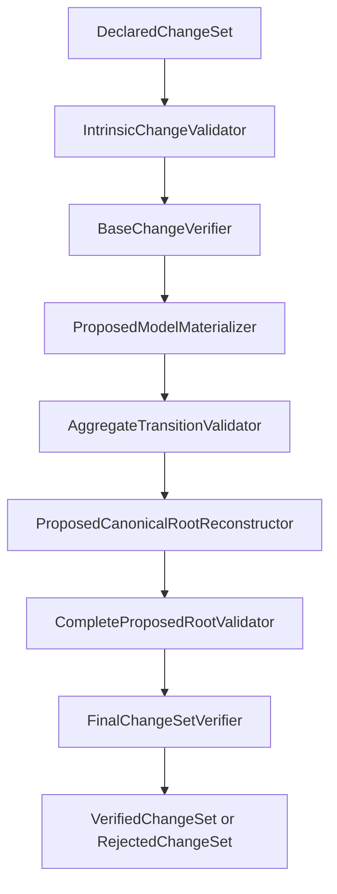

# Canonical Change Architecture

## 1. Purpose

Canonical Change verifies an ordered declared change set against Canonical QA
Model v0.1 and produces immutable evidence of either each stage outcome or final
verification.

## 2. Scope and Non-Scope

The module performs declaration, Base, materialization, aggregate, root, schema,
semantic, and final verification. It does not persist, commit, publish, approve,
deploy, simulate, assess impact, migrate, or repair models.

## 3. V0.1 Trust Model

This is a trusted in-process module. Success construction is owned by stage
services. Results are not an external SDK, transport DTO, or deserialization
contract. Deliberate manual construction is unsupported programmer behavior.

## 4. Module Dependency Direction

`qa-model-change -> qa-model` and
`qa-model-change -> qa-model-validation-core`. Host, Spring, Simulation, Impact
Analysis, and persistence modules remain downstream or unrelated.

## 5. Pipeline Diagram

## 6. Stage Responsibilities

Intrinsic validation checks declaration truth independent of Base. Base
verification checks exact target preconditions. Materialization applies the set
atomically. Aggregate validation checks final relationship endpoints.
Reconstruction preserves root context and replaces artifact arrays. Complete
validation runs authoritative schema before authoritative semantics. Finalization
checks the retained success chain without rerunning validation.

## 7. Evidence Chain

Every successful production result retains mandatory evidence from its previous
stage. Final success exposes declarations and indexes, intrinsic and Base results,
exact Base context/index, Proposed Model, aggregate success, Proposed Root,
schema evidence, semantic evidence, warnings, and version.

## 8. Success Semantics

`VerifiedChangeSet` means all required verification stages passed. It makes no
claim about persistence, publication, approval, deployment, impact, or absence
of warnings.

## 9. Failure Ownership

Phases 1–7 return their own failure result types. Phase 8 returns complete
schema, semantic, infrastructure, or version failure evidence.

## 10. Final Rejection Boundary

`RejectedChangeSet` is only Phase 9 rejection of a Phase 8 result. Its reachable
stages are schema, semantic, infrastructure, unsupported version, and final
evidence consistency. It is not a universal pipeline failure wrapper.

## 11. Warning Policy

Semantic warnings do not invalidate success. Authoritative fields and stable
ordering survive finalization unchanged.

## 12. Version Policy

Only exact Canonical QA Model `0.1` is supported across declarations, artifacts,
Base context/index, Proposed Model, root, and validators. There is no coercion or
migration.

## 13. Identity and Category Model

Logical keys are `(ArtifactCategory, CanonicalIdentity)`. Identity is exact,
case-sensitive, and unnormalized. Node and Relationship ID namespaces are
separate.

## 14. ADDED / MODIFIED / REMOVED Semantics

ADDED requires target absence and an after state. MODIFIED requires an exact
semantically matching Base/before state and replaces the target. REMOVED requires
the matching Base/before state and removes only that target.

## 15. No-Op and Empty-Set Policy

Semantically unchanged MODIFIED declarations are rejected. Empty change sets are
not representable.

## 16. Aggregate Validation vs Validation Core

Aggregate validation protects transition referential integrity. Validation Core
owns complete JSON Schema and semantic authority, including compatibility and
self-reference rules. Schema failure prevents semantic execution.

## 17. Immutability and Determinism

JSON is deep-copied at boundaries, lists are immutable, artifacts and diagnostics
use explicit stable orders, and no time, UUID, or revision is generated.

## 18. Provenance-Sensitive Equality

Java equality is not business semantic equivalence. Re-finalization of one
retained evidence graph is equal. Independent graphs may not be; compare their
artifacts, reconstructed JSON, diagnostics, warnings, and version.

## 19. Exact-Instance Base Evidence Binding

Later stages require the same extracted evidence instance to prevent stale or
substituted in-process data. See ADR-001.

## 20. Public API Trust Boundary

Consumers read public outcome contracts and invoke public stage services.
Package-owned implementations create successful provenance-bearing outcomes.
No result is accepted from untrusted transport.

## 21. Known V0.1 Limitations

The pipeline is caller-orchestrated, in-process, v0.1-only, and cannot resume
from independently reconstructed evidence after process restart.

## 22. Future Extension Boundaries

Persistence or distribution will require stable provenance. Simulation and
Impact Analysis may consume verified evidence later but must not become part of
verification semantics.
